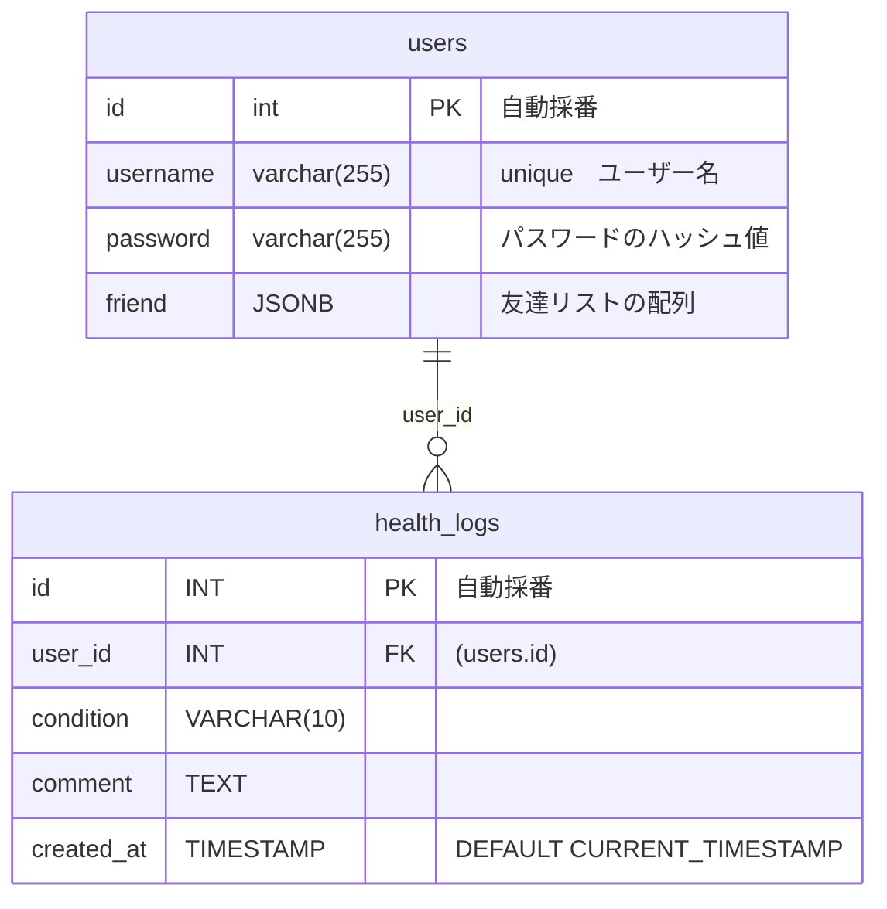

# condition_management

体調管理アプリ

## 要件定義

1. ログイン
- ユーザー ID とパスワードを入カし、システムにログインする

2. 新規登録
- ユーザー名とパスワードを登録する。既存のユーザー名と重複する場合はエラーを返す。

3. 体調入力画面
- ユーザーが体調がBADかGOODかGREATボタンどれかを押して、コメントを書いたらその内容をデータベースに登録する。

4. みんなの体調画面
- ユーザー名と体調とコメントを一覧表示する。画面上に表示するユーザーを増やすボタンを追加する。

5. 追加画面
- 追加したい人のユーザー名を入力して、そのユーザーをみんなの体調画面一覧に追加登録する。

## DB設計

## API設計

| エンドポイント            | 認証 | リクエストメソッド | リクエストパラメータ                     | レスポンスパラメータ                        | ステータスコード | 備考                         |
| :------------------------ | :--- | :----------------- | :--------------------------------------- | :------------------------------------------ | :--------------- | :--------------------------- |
| /api/login                | ×    | POST               | username, password                       | token                                       | 200, 401         | ログイン機能                 |
| /api/register             | ×    | POST               | username, password,password_confirmation | -                                           | 201, 400         | 新規登録機能                 |
| /api/health-logs          | ⚪︎ | POST               | token, status, comment                   | -                                           | 201, 401, 400    | 体調入力機能                 |
| /api/health-logs          | ⚪︎ | GET                | -                                        | [{user_id, username, status, comment}, ...] | 200, 401         | みんなの体調画面表示機能     |
| /api/health-logs/:user_id | ⚪︎ | POST               | token, friends_id(配列)                          | -                                           | 201, 401, 400    | 追加画面でのユーザー追加機能 |

※クッキーやセッションを使って、常にログインしているユーザーのIDを取得できる状態にしておきましょう！friendにuser_idを追加するときにバックエンドで必要になります。
※:user_idは現在ログインしているユーザーのidを入れる。リクエストボディにfriend_id(友達リストに追加したいユーザー)を入れる。（複数）

## 使う技術
- Spring Boot
- Vue3
- postgreSQL
- docker

モックweb-api はファイル配下で nodemon index.js で動きます。